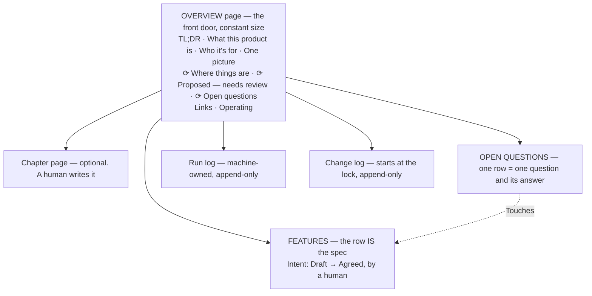

# Spec — the shape of the Blueprint

One overview page, zero or more chapter pages a human may make, and **two databases** — Features and
Open Questions. A feature row IS the spec for that feature. Day 1 the whole Blueprint is an overview page
and two empty databases; that is a valid Blueprint. Companions: [`databases.md`](databases.md) ·
[`targets.md`](targets.md) · [`notion-mechanics.md`](notion-mechanics.md).

## 1. What this document is, and what it is not

1. **The Blueprint is the settled statement of product intent** — what the product should do, why, and
   what it deliberately will not do. It is built **before** development, from whatever exists: a client's
   material, a team's notes, or one person's head and an idea.
2. **It is a specification, not a contract and not a status report.** It records decisions and their
   reasoning. It says nothing about what has been built, because nothing here ever looks at a running
   app.
3. **Only a human's approved decision changes it.** Sources are evidence; a run's draft is a proposal;
   an approved answer is agreed intent. Nothing skips a step.

**Once it is settled, you lock it** ([`../lock.md`](../lock.md) L3). Locking halts nothing; it obliges:
from that moment every change to product intent is recorded in the **change log**, with the ask in the
words of whoever asked — so *what moved since we settled this* is always one readable page, and never a
silent edit to what was agreed. The document records intent; it never tracks what has been built.

**The one thing this shape refuses to do is guess.** An unsupported sentence in a specification is worse
than an admitted gap, because a gap gets asked about and a guess gets built.

## 2. Anatomy



One destination per project. Nothing is ever merged across projects.

## 3. The overview page

The front door. Never moves, never gets renamed, never becomes a child of anything. Where the target is
Notion its page ID is the one identifier this skill cannot rediscover. A **plain heading** is human
prose; a **`⟳` heading** is a saved view. One rule: ***never type under a `⟳`***.

| Block | Content | Cap |
|---|---|---|
| **TL;DR** | What this is, who should read it, what to read first | 2–3 sentences |
| **What this product is** | One paragraph, ending in a one-sentence NOT-clause naming the *kind* of thing this product refuses | 1 paragraph |
| **Who it's for** | Real user kinds and the job each hires it for | 3 lines |
| **How it works, in one picture** | One mermaid diagram | ≤9 nodes |
| **`## ⟳ Where things are`** | Features grouped by `Area` — a view | — |
| **`## ⟳ Proposed — needs review`** | Question proposals waiting on a human — a view | — |
| **`## ⟳ Open questions`** | Approved questions and their answers — a view | — |
| **Links** | Source material, design files, whoever's original documents. Links only | — |
| **Operating** | Who owns this Blueprint · the run-log link · the change-log link once locked · any widening of the content rule (§6) | 4 lines |

**The front page is the same size at 200 features as on day 1** — every human block is capped and every
index on it is a view. That is what keeps a front door readable rather than turning it into the document.

### How a run may write it — the one rule

A run may write an overview block **only as a verbatim proposal a human accepts**, one named block per
write call. Never silently, never as a side effect of applying an answer, never a wholesale page replace.

This differs from the system this skill replaced, deliberately. There, the front door was human-only
because the document was already agreed and a machine editing it could only degrade it. Here the overview
**is part of what is being drafted** — a NOT-clause that no longer matches the features is a defect in the
thing people will build from — so a run must be able to propose the new text. What holds the line is
that the human sees the exact words before they land, and that the proposal names the block it replaces.

**The trap this walks past every time:** on the Notion target, a content replace that omits a child block
deletes that child ([`notion-mechanics.md`](notion-mechanics.md) §3). Every overview write re-emits every
child block, foreign children included, and re-fetches to confirm nothing was lost.

**What does not go on it:** an Areas list in prose (the `Area` property is that list), build rules for
coding agents (they live in the repo's `CLAUDE.md`), a history of every draft (page history covers
it), or any count of anything.

## 4. Chapter pages

A human may make one for an Area with narrative or a diagram no single feature row owns: 2–4 sentences of
what the area is, a flow diagram, and the rules no single row owns. Link to rows with a mention, never a
page block — a page block would *move* the row. **Day 1 there are none and most projects never make one.**
No run creates one, proposes one, writes to one, or reads one in a check. A chapter that restates what a
feature row already says should link instead.

## 5. The feature row body

The row IS the spec. There is no separate feature document.

```
## Why
2–4 sentences, opening with the situation: the problem, who has it, why now. No solution talk.

## Behaviour
FR-1 …    Each numbered requirement is a thing that can fail. If you cannot picture it
FR-2 …    failing, it is not a requirement — it is a wish, and it does not belong here.

## Edge cases
empty · error · slow · offline · not signed in · which record / whose data · ties and
ordering — every default is a decision, so write it.

## Rabbit holes
The implementation traps and the call already made about each. Empty is fine — never a
finding. Its reader is whoever builds this.

## Not doing
One line each, in one shape:  No X — because Y; revisit if Z.
```

`What it does` is a **property**, not a body line, so every view and read path carries it. The body starts
at `## Why`.

**Why five blocks and not one.** They are redundant channels, which is the measured point: removing one
constraint costs −11.8% pass@1 on a single-channel spec against −0.9% on a multi-channel one (Akli et
al.). And numbered failable requirements are the largest single ablation measured on specification
quality — Claude Opus 4.5 86.6 → 73.8, Qwen3-Coder-30B 50.3 → 20.9 (*VeriSpecGen*). A run reports a block
that is missing and **never writes the missing content**, because it has no source for it and inventing it
is the laundering this system exists to prevent.

**One exception, and it is the only machine route into an empty body.** A feature row a human created by
hand has no body at all, and a row with no numbered requirement can never receive an answer — every delta
that would mint one is refused. So where the `Behaviour` block holds **no numbered requirement at all**,
a run may *propose* `## Why` and **`FR-1` only**, derived from a named source and shown verbatim at the
checkpoint, and a person accepts, edits or declines it. **Everything after `FR-1` is a human's to write.**

**`Not doing` — how to write the line. All three parts, one line.** *"No native mobile app — the team
cannot staff two clients; revisit if a customer asks and will pay for it."* The **why** carries the
argument and has to be on the same screen as the refusal. The **revisit if** is what stops a refusal
becoming dogma: the answer to a proposal becomes *"no, and here is exactly what would change our mind"*.
A run **never invents** a `revisit if:` — where one is missing it proposes a question. **A question row
and no marker**, and this is the one place that distinction is load-bearing: a marker blocks
`Intent = Agreed` (§9), and a `Not doing` line whose *refusal and reason are both sourced* is a decision
that has been made, not an unknown. Marking it would block a feature for as long as nobody supplies a
reopening condition — permanently, for the exclusions nobody intends to revisit.

**Scope is where the line is written**, and it needs no field: the overview's NOT-clause binds the whole
product, a `Not doing` line binds the feature it sits on, and a numbered requirement binds its own
feature. **What negation does and does not buy:** a negation opposing a model's default implementation is
complied with as little as 10% of the time and the *format* makes no measurable difference, while a
negation naming a **scope or artifact boundary** — *"this feature does not touch billing"* — measurably
does work (stripping scope language raised out-of-scope agent actions by 11.9–17.2pp). So prefer boundary
wording and do not build a formatting standard.

**How to write one requirement.** Three tests applied to a sentence. **Not a form and not a grammar** —
seven requirement formats spanned ~2.4 points and one model scored identically across all seven. Syntactic
*ambiguity* is what costs: up to **−31.10 points** of pass@1, doubling intra-model output conflict from
14.09% to 28.29%. That is why this skill mandates **no** requirement syntax — not EARS, not Gherkin, not
YAML. Format is a ~2-point lever; content completeness is a 12–29 point one.

1. **One trigger, one actor, one observable outcome**, condition leading: *"When X, the system does Y."*
2. **"And" between two outcomes means two requirements.** Split it.
3. **A requirement must be readable without the requirement above it.** *"FR-4 — the same applies when
   they are offline"* is not a requirement.

**The rest of the rules.** **Ten minutes to fill** — longer means the feature is too big, so split it;
never a licence to leave blocks as placeholders, which is how the −0.9% condition becomes the −11.8% one.
**Behaviour describes what the product does, never how it is built.** **A rabbit hole is a negative
constraint about *how***, in its own block, never mixed into the numbered requirements where
mechanism-flavoured wording primes a memorised wrong solution. **A decided exclusion is a `Not doing`
line; a marker is for unknowns** — never mix them. **Provenance lines live here and only here**, dated,
under the requirement they touched, because a reader who stops at the row never opens the log:

> *(Applied 2026-08-04 from «Can a customer change a pickup slot after paying?» — answer and reasoning
> on that row.)*
>
> *(Narrowed 2026-08-04 by the faithfulness check: the source says "most orders", not "all orders".)*

## 6. What may appear in the Blueprint

Sources arrive full of things that are true and that nobody meant to publish into a document a whole
teamspace reads. **The default, on every project, is: write the role, never the specific.** No customer or
third-party names, no individuals' names, no contract terms or dates, no penalties, no prices. So
`"Northgate Retail Park — P1 4 hours, £250 penalty, contract to 2028-03-31"` is written as *"a site on the
enterprise contract has a four-hour response target for P1 faults, with a penalty"* — and the requirement
is just as failable.

**Two standing exemptions, because the design mandates the thing the rule bars.** The rule is about the
*product being described*, never about the people running the process. So: **the `Operating` block's named
owner** and **every people-typed property** — `Owner`, `Confirmed by` — are outside this rule and are never
a finding. Naming who decides is the record the whole provenance design rests on; a sweep that flags it
fires on the front door every run forever, and a check that always fires is a check nobody reads.
**Everything else about a person still falls under the rule**, including a person named in prose in a
feature body, a requirement, or an answer.

A project may widen this for a class of fact — a public product name, a published price — with **one dated
line in the overview's `Operating` block**, which every run already reads. Where a specific is genuinely
load-bearing and the default forbids it, that is a question row with an owner, not a judgement call inside
a draft. Every writing sub-agent is briefed with this rule, a delta breaking it is refused, and
[`../status.md`](../status.md) C9 sweeps for it after the fact.

## 7. Single home per fact — with one exception

Every fact lives in exactly one place; everywhere else links to it. The `Area` property is the list of
areas; `Intent` is the state of a feature; the applied and closed question rows are the decision log. None
gets a prose copy. **Never restate a number that first appeared somewhere else** — a sibling system in
this org shipped one page saying "33 endpoints" beside another saying "32".

**The exception, asymmetric on purpose.** Agents tolerate 19–26% irrelevant content once the essential
evidence is visible; *missing* the core evidence costs **77–99 points** of resolve rate (*SWE-Explore*).

> **A feature row must be buildable from itself.** Where a link would leave a requirement underspecified,
> the governing constraint is restated inline and marked as derived. Never omit a governing constraint in
> order to avoid restating it.

**Structure helps an agent *find*, not *read*.** All 18 models in one test did better on shuffled context
than on logically ordered context (*Context Rot*). The payoff of this shape is retrieval scoping and
resolvable identity, and nowhere may it be claimed that a well-organised page is easier to read.

## 8. Stable IDs

Everything binds to IDs, never titles, headings or URLs. Titles get edited; URLs change when a page moves
— Notion changed its whole link domain in June 2026, which is the rule proving itself. With traceability
available, 71 subjects across 461 real maintenance tasks were **24% faster and produced 50% more correct
solutions** (Mäder & Egyed, EMSE 2015).

- **Entity IDs key everything** — question → feature, the mapping, every provenance line.
- **Requirement numbers are per feature and never renumbered.** `FR-3` means `FR-3` forever. Human form
  `FR-3 of «Claim a swap»`; machine form `<feature id>#FR-3`.
- **Deleting a requirement leaves a tombstone**, never a gap that gets refilled:
  > FR-4 — *withdrawn 2026-08-04, replaced by FR-7. No behaviour here.*
- **Splitting a feature is a human's decision, not a run's proposal.** When a human asks for it: the new
  row starts at `FR-1`, every requirement that moved leaves a tombstone pointing at the new ID and
  number, relations are **re-pointed rather than retyped**, and the run then verifies **every non-empty
  line of the source resolves to a line on a destination**, mechanically, *after* the write. Any line that
  does not halts the split and is named; nothing is deleted to make the check pass.

## 9. `[NEEDS CLARIFICATION]` markers

The one and only blocking mechanism in the Blueprint. It exists because whoever builds this will not raise
the question: baseline agents ask a clarifying question on only **24.12%** of underspecified tasks, and one
frontier model asked in **1.7%** of its non-actions. *Underspecification does not make agents fail — it
makes them guess*, so the document has to carry the question.

```
[NEEDS CLARIFICATION: can a customer change a pickup slot after paying? → Question: <link to the row>]
```

- **A marker must name the entity it is about** — the feature, the requirement number, the specific field
  or record — not only the doubt. Target ambiguity moves Wrong Target from 9.6% to **75.1%** (Ji et al.).
  *"Is this right?"* is not a marker; the example above is.
- Every marker points at one question row whose `Touches` points back — **or is `carried`, and says so**.
- **An open marker blocks `Intent = Agreed`,** and a feature that is not `Agreed` is named in every
  readiness report ([`../lock.md`](../lock.md) L1). That is the only thing that blocks anything.
- **A marker is scoped to what it names, not to the page it sits on.**
- **Carried is a legitimate state, and it is not the same as broken.** A run may mint more markers than it
  may propose questions, because [`../questions.md`](../questions.md) Q4 caps what is put to a person at a
  sitting. A marker whose question has not been proposed yet reads `→ Question: carried`, blocks
  `Intent = Agreed` like any other, and waits for the next sitting. A marker pointing at a row that no
  longer exists is **broken** and is a fault. [`../status.md`](../status.md) C5 prints the two apart,
  because a queue buried in a fault list teaches people to skip the list. **Never write
  `→ Question: pending`**: it names neither state, and a reader cannot tell whether somebody owes an
  answer or nobody has been asked.
- **Never match a marker on the literal string `[NEEDS`** — the bracket is escaped on the round trip and
  the match finds zero markers on a document full of them
  ([`notion-mechanics.md`](notion-mechanics.md) §3).

### Five ways a marker is removed, and this is the canonical list

Every file that removes a marker **points at this list rather than restating it** — three restatements in
three files were once three different lists, which is how a route two files sanctioned read as forbidden
in the third.

1. **An approved answer is applied.** Removing the marker and writing the answer in are **one act**,
   performed by [`../resolve.md`](../resolve.md) R3 once the answer is vetted. This is the ordinary route
   and most markers leave by it.
2. **Its question row reached a terminal state** — `Closed (not applied)` or `Rejected`. A marker
   pointing at a row nobody will ever answer blocks for nothing: remove it and cite the row.
3. **The question was a decided exclusion, and becomes a `Not doing` line** in the one shape §5 gives. A
   decision is not an unknown, and a marker is only ever for an unknown.
4. **A human rejected the proposal as *not a real gap* or *already decided*.** The rejection reason is
   what decides this ([`../questions.md`](../questions.md) Q4): those two reasons say the marker was
   raised over nothing, so it goes, citing the rejected row or the requirement that answers it.
   **A rejection reading *ask it better* removes nothing** — the gap is real and only the wording was
   wrong, so the marker stays `carried`. Without this split, rejecting a badly-worded proposal either
   stranded the marker forever or silently converted a known unknown into an unknown unknown.
5. **It was decided outside the system and recorded here — a gate rather than a shortcut.** A decision
   made out loud, in a meeting, in a message clears a marker only by becoming an ordinary vetted answer
   first. At the checkpoint the run drafts the row: `Question` = the marker's own text; `Answer & why` =
   the human's words **verbatim**, never a paraphrase; `Owner` = the person who said them;
   `Confirmed = AI generated`; `Status = Answered`; **`Confirmed by` empty**. The human puts their name in
   `Confirmed by` — one click, on the screen they are already reading — and the next resolve run writes it
   in. **If they do not click, nothing enters the document:** the row sits with an empty `Confirmed by`,
   [`../status.md`](../status.md) C6 names it, and the marker stands. That is the honest failure, and it
   is strictly better than a claim entering ungated.

**None of the five is a bypass of another.** A run may never write an answer straight in, and never
without a row. **A marker removal with no row ID in the run-log entry is a bug, not a tidy-up.**

**Never invent the missing content.** A guess written as prose launders a guess into the source of truth.
Contradictions between sources are surfaced, never silently resolved.

## 10. What the shape is for

| I want to… | Where I look |
|---|---|
| **Settle the scope — with a client, a team, or yourself** | The overview's NOT-clause, then the feature rows at `Intent = Agreed` and their `Not doing` lines |
| **Build the first thing** | Feature rows at `Agreed`: requirements, `Not doing` lines, rabbit holes. Every requirement can fail, so it is both the build brief and the test list |
| **Know what is still undecided** | Open Questions. A question with a named owner is the honest form of "we do not know yet" |
| **Judge whether a proposed feature fits** | The NOT-clause, then the `Not doing` lines of the features it touches. A citation with an argument attached |

The acceptance test: hand the Blueprint to somebody who has never seen the project and ask what the
product does, what one agreed feature must and must not do, and what they would still have to guess at.
An honest *"that is not written down"* on the third beats a confident invention.

**The build packet — derived at build time, never stored.** Whoever builds is never handed the feature
page. They are handed a packet assembled at that moment, from the rows, so it cannot be stale and there is
no second artifact to maintain.

```
BUILD PACKET — «Claim a swap»           assembled 2026-08-04 from the locked Blueprint

WHAT THIS PRODUCT IS NOT       the overview's NOT-clause, verbatim
NOT DOING, HERE                this feature's Not doing lines, each with its why
BUILD THIS                     the numbered requirements
NOT DECIDED — do not invent    every open question bearing on this feature. If your work
                               touches one of these, stop and ask
CALLS ALREADY MADE             the Rabbit holes block
CONTEXT                        What it does, and Why, verbatim
```

The two labelled negatives are the point: a slice cannot express them by omission — a missing requirement
reads as work to do and an open question reads as a detail to choose. **It is assembled, never authored:**
nobody writes one by hand and nothing stores one.
