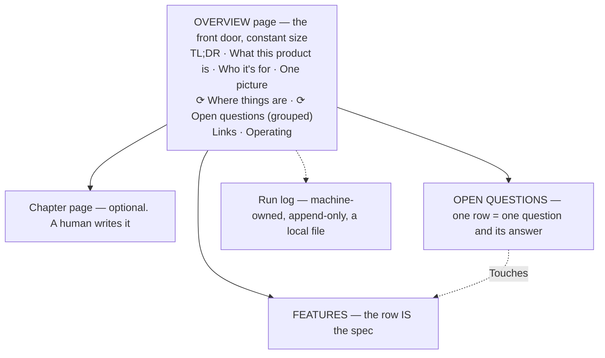

# Spec — the shape of the Blueprint

One overview page, zero or more chapter pages a human may make, and **two databases** — Features and
Open Questions. A feature row IS the spec for that feature. Day 1 the whole Blueprint is an overview page
and two empty databases; that is a valid Blueprint. Companions: [`databases.md`](databases.md) ·
[`targets.md`](targets.md) · [`notion-mechanics.md`](notion-mechanics.md).

## 1. What this document is, and what it is not

1. **The Blueprint is the current statement of product intent** — what the product should do, why, and
   what it deliberately will not do. It is built **before** development, from whatever exists: a client's
   material, a team's notes, or one person's head and an idea.
2. **It is a specification, not a contract and not a status report.** It records decisions and their
   reasoning. It says nothing about what has been built, because nothing here ever looks at a running
   app.
3. **Only a human's approved decision changes it.** Sources are evidence; a run's draft is a proposal;
   an approved answer is agreed intent. Nothing skips a step.

**Nothing ever declares it finished** (v16 — the lock and the change log were removed at the owner's
direction, for simplicity). The document stays live and current, every change runs the same gates it
always did, and [`../status.md`](../status.md) answers *how much of this is still open?* fresh
whenever it is asked rather than the document carrying a settled state. The document records intent;
it never tracks what has been built.

**The one thing this shape refuses to do is guess.** An unsupported, unlabeled sentence in a
specification is worse than an admitted gap, because a gap gets asked about and a guess gets built. A
**labeled convention default** ([`../SKILL.md`](../SKILL.md) rule 4) is neither: adopted in the open,
tagged, ledger-listed, counted and reported until a human ratifies its batch — the third state between sourced and
unknown.

## 2. Anatomy



One destination per project. Nothing is ever merged across projects.

## 3. The overview page

The front door. Never moves, never gets renamed, never becomes a child of anything. Where the target is
Notion its page ID is the one identifier this skill cannot rediscover. A **plain heading** is human
prose; a **`⟳` heading** is a saved view. One rule: ***never type under a `⟳`***.

| Block | Content | Cap |
|---|---|---|
| **TL;DR** | What this is, who should read it, what to read first | 2–3 sentences |
| **What this product is** | One paragraph carrying the essence: **the problem, who has it, what this product does about it, and — where a source states it — what observable change means it worked** (one or two things somebody could check, never an invented number; unstated means an owned open question, not a guess) — ending in a one-sentence NOT-clause naming the *kind* of thing this product refuses | 1 paragraph |
| **Who it's for** | **Real user kinds — never "users"** — one line each: the kind, the job they hire this product for, and (where a source says) what they use for that job today. May close with one **`Not for:`** line naming who this product deliberately does not serve — sourced, like any exclusion, never invented | 3 lines + one optional `Not for:` line |
| **How it works, in one picture** | One mermaid diagram | ≤9 nodes |
| **`## ⟳ Where things are`** | Features grouped by `Area` — a view | — |
| **`## ⟳ Open questions`** | Live questions and their answers — a view **grouped by `Status`, the groups collapsible** (the owner's 2026-08-06 layout ask: the section stays open, the groups collapse). Since v13 a run writes questions straight to `Open`, so this view carries rows a person may not have read yet; the `Unsent — packet candidates` view is the reading screen and is a database tab only, never embedded | — |
| **Links** | Source material, design files, whoever's original documents. Links only | — |
| **Operating** | The run record's **path** in the working folder — `record/run-log.md`, a local file since v16, so a path rather than a link ([`targets.md`](targets.md) §5) · the **always-ask register** — the dated list of topics no convention default may settle, seeded at `init` with its two mandatory entries and widened only by a human ([`../SKILL.md`](../SKILL.md) rule 4), kept to **one line, topics comma-separated** · any widening of the content rule (§6) · a ratified vocabulary line, where one exists — the canonical term, its superseded aliases, dated | 6 lines |

**The front page is the same size at 200 features as on day 1** — every human block is capped and every
index on it is a view. That is what keeps a front door readable rather than turning it into the document.

**`Who it's for` is load-bearing, not decoration.** It is the block every grilling reconciles the
features against ([`../questions.md`](../questions.md) Q2, lens 5): a named user kind no feature serves,
an actor the requirements keep naming that this block never does, and a job no requirement delivers are
all findings. Where the sources name no audience at all, **the audience itself is the gap** — a marker on
this block and a proposed question, never an invented persona: a made-up user kind is the same laundering
as a made-up requirement, wearing a friendlier face.

### The overview IS the product-level spec — and the machinery treats it as one

There is no separate product-definition entity, deliberately: these blocks are where every product-level
fact lives, and a second home would be the split this file's §7 exists to prevent. What makes that more
than a filing decision is that **the whole question machinery serves this level exactly as it serves a
feature row**: a product-level unknown is a marker on the block where it bites; its question is a
**project-level row** — `Touches` empty ([`databases.md`](databases.md) §2) — proposed, gated, owned and
answered like any other; lens 5 grills these blocks against the features every sitting; and a vetted
project-level answer lands through [`../resolve.md`](../resolve.md) R3.1's **overview route**: the run
drafts the block into the row's `Why asked` and flags it; a person accepts those words or writes their
own into `Answer & why`; the next run writes exactly that text. **The human still sees the exact words
before they land** — that is what this rule protects, and the route satisfies it in one round trip
instead of through a checkpoint that no longer exists. **The essence gets the
same rigor the features get** — sourced, grilled, marked, resolved — it just gets it through the front
door's own gate rather than a body write, because the front door is the one page every reader trusts
without cross-checking.

### How a run may write it — the one rule

A run may write an overview block **only as a verbatim proposal a human accepts**, one named block per
write call. Never silently, never as a side effect of applying an answer, never a wholesale page replace.

**One carve-out, and it is the first write only** (v16). At [`../init.md`](../init.md) I5 the overview
does not exist yet: there is no block to replace and no text for a human to accept instead, and I5
calls it *"the largest single write the overview ever receives."* That write is sanctioned — **but the
skeleton a human confirms at I3 must carry the block text itself, not only the block names**, or the
acceptance is of a table of contents rather than of prose. *Measured: a run whose I3 screen listed
block names shipped a contract term — "thirty-day terms" — into the front door, where §6 bars it and
where this rule then forbade fixing it in place; the same phrase in a feature body was correctly
narrowed, so the document contradicted itself with no route to repair.*

**And after the first write, a barred specific in an overview block has a route** — it is not stranded.
The run reports it and proposes the corrected block text verbatim, exactly as any other overview
change; where no acceptance arrives, [`../resolve.md`](../resolve.md) R3.1's overview route carries it
as a project-level row. **What is never allowed is leaving it unreported because no route seemed to
exist.**

This differs from the system this skill replaced, deliberately. There, the front door was human-only
because the document was already agreed and a machine editing it could only degrade it. Here the overview
**is part of what is being drafted** — a NOT-clause that no longer matches the features is a defect in the
thing people will build from — so a run must be able to propose the new text. What holds the line is
that the human sees the exact words before they land, and that the proposal names the block it replaces.

**The vocabulary line is written the same way** — a verbatim proposal a human accepts, usually the
resolve of a project-level question ([`../resolve.md`](../resolve.md) R3.1). A **contested** name — two
live candidates — is a question, never a line. Writer briefs carry the line once it exists, which is
what makes the canonical term bind future requirement text.

**The trap this walks past every time:** on the Notion target, a content replace that omits a child block
deletes that child ([`notion-mechanics.md`](notion-mechanics.md) §3). Every overview write re-emits every
child block, foreign children included, and re-fetches to confirm nothing was lost.

**Three clarifications, each paid for by a measured collision.** A run may propose **marker text for an
overview block at the same stop** that proposes overview text — a contradiction whose only side is the
front door must be markable there, or it has no home at all: in one measured project a contradiction
contested only on the overview ended with no marker, no row, and a log line falsely claiming otherwise.
An I6 or A5 **narrowing of an overview block is a proposal, never an in-place fix** — "fixed in place"
belongs to feature bodies, because the front door is the one page every reader trusts without
cross-checking. And this section's *"any count of anything"* bar binds **human prose**; the `⟳`
**generated views are exempt** — they are rebuilt from a fresh scan at every write-back and never
carried forward, which is the exact property the bar exists to protect.

**What does not go on it:** an Areas list in prose (the `Area` property is that list), build rules for
coding agents (they live in the repo's `CLAUDE.md`), a history of every draft (page history covers
it), or any count of anything.

### Views are regenerated, never patched

The `⟳` views, and the local-markdown target's equivalent generated lists
([`targets.md`](targets.md) §3), are never edited in place — they are **thrown away and rebuilt from a
fresh scan of the actual current rows**, every time a write-back touches a feature's
`Area`/`What it does` or a question's `Status`. Patching a view's existing text forward from what
it said last time is exactly how a reader ends up trusting a count that was true an hour ago.

**This is why no number is ever carried into the TL;DR**, restated here because a simulated run's TL;DR
grew past its own cap and quoted a live question tally — both already barred by "what does not go on it"
above — and nothing caught it, because nothing re-derives the TL;DR's own claims against the rows before
publishing them. **Regenerating every view it touches is part of the same write-back**, not a follow-up
step: [`../add.md`](../add.md) A5, [`../resolve.md`](../resolve.md) R5, [`../questions.md`](../questions.md)
and Q6 each point here rather than restating it.
[`../status.md`](../status.md) C8 is the mechanical backstop — it recomputes the same counts from the same
rows and names any view whose printed state disagrees with them.

## 4. Chapter pages

A human may make one for an Area with narrative or a diagram no single feature row owns: 2–4 sentences of
what the area is, a flow diagram, and the rules no single row owns. Link to rows with a mention, never a
page block — a page block would *move* the row. **Day 1 there are none and most projects never make one.**
No run creates one, proposes one, writes to one, or reads one in a check. A chapter that restates what a
feature row already says should link instead.

## 5. The feature row body

The row IS the spec. There is no separate feature document.

```
## Why
2–4 sentences, opening with the situation: the problem, who has it, why now. No solution talk.

## Behaviour
FR-1 …    Each numbered requirement is a thing that can fail. If you cannot picture it
FR-2 …    failing, it is not a requirement — it is a wish, and it does not belong here.

## Edge cases
empty · error · slow · offline · not signed in · which record / whose data · ties and
ordering — every default is a decision, so write it.

## Rabbit holes
The implementation traps and the call already made about each. Empty is fine — never a
finding. Its reader is whoever builds this.

## Not doing
One line each, in one shape:  No X — because Y; revisit if Z.
```

`What it does` is a **property**, not a body line, so every view and read path carries it. The body starts
at `## Why`.

**Why five blocks and not one.** They are redundant channels, which is the measured point: removing one
constraint costs −11.8% pass@1 on a single-channel spec against −0.9% on a multi-channel one (Akli et
al.). And numbered failable requirements are the largest single ablation measured on specification
quality — Claude Opus 4.5 86.6 → 73.8, Qwen3-Coder-30B 50.3 → 20.9 (*VeriSpecGen*). A run reports a block
that is missing and **never writes the missing content**, because it has no source for it and inventing it
is the laundering this system exists to prevent.

**One exception, and it is the only machine route into an empty body.** A feature row a human created by
hand has no body at all, and a row with no numbered requirement can never receive an answer — every delta
that would mint one is refused. So where the `Behaviour` block holds **no numbered requirement at all**,
a run **writes** `## Why` and **`FR-1` only** where a **vetted answer** or a **named source** supplies
it ([`../resolve.md`](../resolve.md) R4, [`../add.md`](../add.md) A4 step 6) — the content is a human's
own answer or a source's own words, so writing it invents nothing, and its text goes in the report.
Where **neither** supplies it, nothing is written at all. **Everything after `FR-1` is a human's to
write.**

**`Not doing` — how to write the line. All three parts, one line.** *"No native mobile app — the team
cannot staff two clients; revisit if a customer asks and will pay for it."* The **why** carries the
argument and has to be on the same screen as the refusal. **Where the source gives a refusal but no
why, the line stands without one and is named in the report — the same rule the `revisit if:` gets, and
for the same reason** (v20): a run never invents an argument for somebody else's decision, and a
restatement of the refusal dressed as a because is worse than an honest gap. **A refusal whose why the
source *did* give never goes somewhere with no room for it**: the overview's NOT-clause names the kind
of thing the product refuses and has no why slot, so an exclusion that carries an argument is written
as a `Not doing` line on the feature it binds, and the NOT-clause names the kind. *Measured: an
exclusion with a stated why — "the partners voted against it in June" — was routed to the NOT-clause,
and the argument left the document entirely with nothing reporting that it had.* The **revisit if** is what stops a refusal
becoming dogma: the answer to a proposal becomes *"no, and here is exactly what would change our mind"*.
A run **never invents** a `revisit if:`, and since v16 it does not ask for one either: a missing
reopening condition is **one line in the report and nothing else**
([`../questions.md`](../questions.md) Q2 sweep item 4 is the single home). **No question and no
marker** — a marker is an admitted unknown (§9), and a `Not doing` line whose *refusal is sourced* is a
decision that has been made, whether or not the source also gave its reason. Marking it would misreport a settled refusal as open
for as long as nobody supplies a reopening condition — permanently, for the exclusions nobody intends
to revisit — and asking about it turns a made decision into a strategy conversation the client did
not need to have.

**Scope is where the line is written**, and it needs no field: the overview's NOT-clause binds the whole
product, a `Not doing` line binds the feature it sits on, and a numbered requirement binds its own
feature. **What negation does and does not buy:** a negation opposing a model's default implementation is
complied with as little as 10% of the time and the *format* makes no measurable difference, while a
negation naming a **scope or artifact boundary** — *"this feature does not touch billing"* — measurably
does work (stripping scope language raised out-of-scope agent actions by 11.9–17.2pp). So prefer boundary
wording and do not build a formatting standard.

**How to write one requirement.** Three tests applied to a sentence. **Not a form and not a grammar** —
seven requirement formats spanned ~2.4 points and one model scored identically across all seven. Syntactic
*ambiguity* is what costs: up to **−31.10 points** of pass@1, doubling intra-model output conflict from
14.09% to 28.29%. That is why this skill mandates **no** requirement syntax — not EARS, not Gherkin, not
YAML. Format is a ~2-point lever; content completeness is a 12–29 point one.

1. **One trigger, one actor, one observable outcome**, condition leading: *"When X, the system does Y."*
2. **"And" between two outcomes means two requirements.** Split it.
3. **A requirement must be readable without the requirement above it.** *"FR-4 — the same applies when
   they are offline"* is not a requirement.

**The rest of the rules.** **Ten minutes to fill** — longer means the feature is too big, so split it;
never a licence to leave blocks as placeholders, which is how the −0.9% condition becomes the −11.8% one.
**A body never cites this skill's own machinery** (v20) — no `spec/…` path, no rule number, no phase
identifier like `I6` or `Q4`. Naming an act in plain words is fine, and the provenance lines below do
it (*"by the faithfulness check"*). The
Blueprint is read by people building a product, and a machine's own filing system in a requirement is
the two-roots confusion ([`../SKILL.md`](../SKILL.md)) leaking into the front of the house; where a
constraint is derived from another feature, cite **that feature**.
**Behaviour describes what the product does, never how it is built.** **A rabbit hole is a negative
constraint about *how***, in its own block, never mixed into the numbered requirements where
mechanism-flavoured wording primes a memorised wrong solution. **A decided exclusion is a `Not doing`
line; a marker is for unknowns** — never mix them. **Provenance lines live here and only here**, dated,
under the requirement they touched, because a reader who stops at the row never opens the log:

> *(Applied 2026-08-04 from «Can a customer change a pickup slot after paying?» — answer and reasoning
> on that row.)*
>
> *(Narrowed 2026-08-04 by the faithfulness check: the source says "most orders", not "all orders".)*

**A convention default is one labeled sentence in the block where it bites**, in one of two shapes and no
other — `Default (standard practice — ratify on review): reset links are single-use and expire.
(run 9f2c1a · 2026-08-14)` or `Default (adopted from the ratified design, frame 298:9042 — ratify on
review): …` — written only under [`../SKILL.md`](../SKILL.md) rule 4's four conditions, listed on its
run's defaults ledger, and re-labeled `(standard practice — ratified <date>)` when its batch is ratified —
[`../questions.md`](../questions.md) Q1 performs the re-label, on the human's named act, and logs it.
A vetoed default is removed by the same procedure and becomes a marker plus a question. **The label is the
provenance**: an unlabeled sentence claiming convention status is exactly the laundering §9 exists to
prevent.

## 6. What may appear in the Blueprint

Sources arrive full of things that are true and that nobody meant to publish into a document a whole
teamspace reads. **The default, on every project, is: write the role, never the specific.** No customer or
third-party names, no individuals' names, no contract terms or dates, no penalties, no prices. So
`"Northgate Retail Park — P1 4 hours, £250 penalty, contract to 2028-03-31"` is written as *"a site on the
enterprise contract has a contracted response target for P1 faults, with a penalty for missing it"* — and
the requirement is just as failable, because what makes it failable is the target existing and being
missable, not its length. *(v20: this example used to keep "four-hour", which is a contract term the
sentence above bars — the rule's own worked answer broke the rule, and a reader copying it would leak
the one figure it was demonstrating how to remove.)*

**One standing exemption, because the design mandates the thing the rule bars.** The rule is about the
*product being described*, never about the people running the process. So: **the people-typed `Owner`
property** is outside this rule and is never a finding — who is carrying a question is an informal label a
human may set ([`databases.md`](databases.md) §2), and a check that always fires is a check nobody reads. (Until 2026-08-06 the
`Operating` block also carried a named owner under this exemption; the owner had it removed, so the
overview names nobody and per-question `Owner` is the only named-person surface.)
**Everything else about a person still falls under the rule**, including a person named in prose in a
feature body, a requirement, or an answer.

A project may widen this for a class of fact — a public product name, a published price — with **one dated
line in the overview's `Operating` block**, which every run already reads. Where a specific is genuinely
load-bearing and the default forbids it, that is a question row with an owner, not a judgement call inside
a draft. Every writing sub-agent is briefed with this rule, a delta breaking it is refused, and
[`../status.md`](../status.md) C9 sweeps for it after the fact.

**Where this rule collides with [`../SKILL.md`](../SKILL.md) rule 1 — a barred specific inside a
human's verbatim field — there is one route and no other: a run never edits the field.** It reports the
row and the class of thing found, and the human either edits the field themselves or records a dated
widening in `Operating`. A human's instruction to the run to make the edit is transcribed verbatim into
the log and becomes a question row owned by that human — **an instruction, spoken or typed, is never a
licence for a run to write a field this rule bars it from writing.** Three measured projects resolved
this collision three different ways; one of them edited ten human-set fields on a spoken authorisation,
which is the exact shape rule 1 was hardened against, and this paragraph exists so it cannot happen a
second time.

**The rule reaches every character of an in-scope free-text field, including a sign-off at the end of
it.** *"— Grace, 2026-08-04"* closing an `Answer & why` is still an individual's name in a field this rule
covers; the exemption is the `Owner` **property** itself, never prose that sits
next to it in a text field. A simulated run's own faithfulness check correctly scrubbed a name from
feature-body prose while five separately-signed answers sat uncaught in the same project's `Answer & why`
field, because the sweep followed the property list rather than reading every character of the fields it
was already scoped to.

**A source calling its own number a placeholder does not make the number safe to publish.** *"100 points =
$5 off, TBD"* is still a specific figure. Write it as *"points redeem at a fixed rate the team has not yet
set"*, and let an open question carry the real number once one exists — the source's own hedge is not a
license, it is the tell that the figure was never settled.

**No field exists outside [`databases.md`](databases.md) §1/§2's property lists.** An `Approved:` line, a
`Verified by:` note, or anything else added to a row that is not one of the named properties is a fact
with no home — invisible to any check that reads the schema rather than the raw text, so its content is
unaudited by construction. A fact needing a place goes in `Answer & why` or the row's own governed shape;
it never gets a field nobody defined.

## 7. Single home per fact — with one exception

Every fact lives in exactly one place; everywhere else links to it. The `Area` property is the list of
areas; the applied and closed question rows are the decision log. None
gets a prose copy. **Never restate a number that first appeared somewhere else** — a sibling system in
this org shipped one page saying "33 endpoints" beside another saying "32".

**The exception, asymmetric on purpose.** Agents tolerate 19–26% irrelevant content once the essential
evidence is visible; *missing* the core evidence costs **77–99 points** of resolve rate (*SWE-Explore*).

> **A feature row must be buildable from itself.** Where a link would leave a requirement underspecified,
> the governing constraint is restated inline and marked as derived. Never omit a governing constraint in
> order to avoid restating it.

**Structure helps an agent *find*, not *read*.** All 18 models in one test did better on shuffled context
than on logically ordered context (*Context Rot*). The payoff of this shape is retrieval scoping and
resolvable identity, and nowhere may it be claimed that a well-organised page is easier to read.

## 8. Stable IDs

Everything binds to IDs, never titles, headings or URLs. Titles get edited; URLs change when a page moves
— Notion changed its whole link domain in June 2026, which is the rule proving itself. With traceability
available, 71 subjects across 461 real maintenance tasks were **24% faster and produced 50% more correct
solutions** (Mäder & Egyed, EMSE 2015).

- **Entity IDs key everything** — question → feature, the mapping, every provenance line.
- **Requirement numbers are per feature and never renumbered.** `FR-3` means `FR-3` forever. Human form
  `FR-3 of «Claim a swap»`; machine form `<feature id>#FR-3`.
- **Deleting a requirement leaves a tombstone**, never a gap that gets refilled:
  > FR-4 — *withdrawn 2026-08-04, replaced by FR-7. No behaviour here.*
- **Splitting a feature is a human's decision, not a run's proposal.** When a human asks for it — the
  ask is a source handed to `add`, the one write seam for material ([`../add.md`](../add.md) A3) — the new
  row starts at `FR-1`, every requirement that moved leaves a tombstone pointing at the new ID and
  number, relations are **re-pointed rather than retyped**, and that `add` run then verifies **every
  non-empty line of the source resolves to a line on a destination**, mechanically, *after* the write. Any line that
  does not halts the split and is named; nothing is deleted to make the check pass.

## 9. `[NEEDS CLARIFICATION]` markers

The one and only admitted-gap mechanism in the Blueprint — it blocks nothing (v13). It exists because whoever builds this will not raise
the question: baseline agents ask a clarifying question on only **24.12%** of underspecified tasks, and one
frontier model asked in **1.7%** of its non-actions. *Underspecification does not make agents fail — it
makes them guess*, so the document has to carry the question.

```
[NEEDS CLARIFICATION: can a customer change a pickup slot after paying? → Question: <link to the row>]
```

- **A marker must name the entity it is about** — the feature, the requirement number, the specific field
  or record — not only the doubt. Target ambiguity moves Wrong Target from 9.6% to **75.1%** (Ji et al.).
  *"Is this right?"* is not a marker; the example above is.
- Every marker points at one question row whose `Touches` points back — **or is `carried`, and says so**.
- **An open marker is an admitted gap, and it blocks nothing** (v13). It is counted by
  [`../status.md`](../status.md) C5 and named in its `What is still unsettled` block. Nothing blocks
  on it and nothing ever has to be cleared before the document can be used.
- **A marker is scoped to what it names, not to the page it sits on.**
- **Carried is a legitimate state, and it is not the same as broken — and it is a state between
  sittings, never a parking lot.** Write runs mint markers between questions sittings — a resolve run's
  narrower marker, an init gap — and a marker whose question has not been proposed yet reads
  `→ Question: carried`, is counted like any other, and waits for the next questions run.
  **That run disposes every carried marker** ([`../questions.md`](../questions.md) Q2 sweep item 1,
  Q4) — a client-bound gap becomes a question row, a convention-settled one becomes a labeled default
  with the marker patched to its ledger line — so after any questions sitting the carried count reads zero, except markers a human's *ask it better*
  rejection (route 4) or defaults veto (route 6) returned to `carried`. On one measured
  project the old per-sitting cap let this backlog grow silently to ~80 known gaps with no row behind
  them — more than every question ever asked — which is the failure this rule now forbids. **A carried marker born from a
  contradiction between sources also cites its inventory id and the run-log entry holding both verbatim
  quotes** — `→ Question: carried (CON-7 · run-log 2026-08-04-init-1)`, resolved against `record/run-log.md` ([`targets.md`](targets.md) §5) — so the sitting that finally
  proposes it dereferences the quotes rather than re-paraphrasing a compact marker
  ([`../init.md`](../init.md) I7 owns the inventory). A marker pointing at a row that no
  longer exists is **broken** and is a fault. [`../status.md`](../status.md) C5 prints the two apart,
  because a queue buried in a fault list teaches people to skip the list. **Never write
  `→ Question: pending`**: it names neither state, and a reader cannot tell whether somebody owes an
  answer or nobody has been asked.
- **Never match a marker on the literal string `[NEEDS`** — the bracket is escaped on the round trip and
  the match finds zero markers on a document full of them
  ([`notion-mechanics.md`](notion-mechanics.md) §3).

### Six ways a marker is removed, and this is the canonical list

Every file that removes a marker **points at this list rather than restating it** — three restatements in
three files were once three different lists, which is how a route two files sanctioned read as forbidden
in the third.

1. **An approved answer is applied.** Removing the marker and writing the answer in are **one act**,
   performed by [`../resolve.md`](../resolve.md) R3 once the answer is vetted. This is the ordinary route
   and most markers leave by it.
2. **Its question row reached a terminal state** — `Closed (not applied)` or `Rejected`. A marker
   pointing at a row nobody will ever answer blocks for nothing: remove it and cite the row.
3. **The question was a decided exclusion, and becomes a `Not doing` line** in the one shape §5 gives. A
   decision is not an unknown, and a marker is only ever for an unknown.
4. **A human rejected the proposal as *not a real gap* or *already decided*.** The rejection reason is
   what decides this ([`../questions.md`](../questions.md) Q4): those two reasons say the marker was
   raised over nothing, so it goes, citing the rejected row or the requirement that answers it.
   **A rejection reading *ask it better* removes nothing** — the gap is real and only the wording was
   wrong, so the marker is returned to `carried` ([`../questions.md`](../questions.md) Q6 step 2). Without this split, rejecting a badly-worded proposal either
   stranded the marker forever or silently converted a known unknown into an unknown unknown.
5. **It was decided outside the system and recorded here — a gate rather than a shortcut.** A decision
   made out loud, in a meeting, in a message clears a marker only by becoming an ordinary answer
   first. The run drafts the row: `Question` = the marker's own text; `Answer & why` =
   the human's words **verbatim**, never a paraphrase; `Owner` is left alone — no run writes it ([`databases.md`](databases.md) §2).

   **Verbatim is checked, not intended** (v20). Before a run may record any of this, the words it is
   about to write must be **found in the captured reply** — the same mechanical test
   [`../SKILL.md`](../SKILL.md) rule 6(d) applies to a quotation: search the stored capture for the
   text, matching on normalised whitespace. **Text that is not there is not theirs**: the run does not
   write it, does not set `Answered`, and says which row it could not record and why. A run may
   summarise nothing into a human's mouth, compose nothing in their voice, and sign nothing with their
   name. *Measured, and it is the reason this paragraph exists: a run wrote a ten-line first-person
   answer — reasoning, a supporting fact and a closing "so I am comfortable saying it" — signed with
   the human's name, at `Status = Answered`, on a question that human had never been asked, in a
   session where they had said "do not take a guess from me". A second row recorded them accepting a
   proposal that did not exist when they last spoke. Both were plausible, both were in character, and
   neither was said. This is the laundering the whole document exists to prevent, arriving through the
   one route that is allowed to write a human's words.* **Where the
   words were given to the run directly — at a review, in the working conversation — the row is recorded
   at `Status = Answered` as that human's own move, and the next resolve run writes it in.**

   **A relayed client answer is also `Answered`, and this is the arbitration** (v17). Where a person at
   the keyboard relays an answer **the client gave to a question this document asked** — the packet loop
   [`../questions.md`](../questions.md) Q6 defines, which is how client answers are *designed* to
   arrive — the row is recorded at `Answered` with the answer **verbatim** and one clause naming who
   relayed it and when. The relayer is the human of record: they are vouching for the words exactly as
   a checkpoint transcription vouches for spoken ones, and [`../SKILL.md`](../SKILL.md) rule 1 is
   satisfied because a human did give the answer and a human did put it here. *This branch said `Open`
   until v17, and the consequence was structural rather than cautious: **every** client answer arrives
   relayed, so no answer obtained through the skill's own packet loop could ever reach `Answered`. A
   measured run offered the sitting, was answered, and stranded seven verbatim client decisions at
   `Open`, where no `status` check could see them either.*

   **What stays `Open` is a decision nobody put to this document** — overheard, mentioned in passing,
   quoted from a meeting that was not answering a row here. That person can be asked properly, so the
   row waits for them, and **if they never move it, nothing enters the document:** the row sits `Open`,
   [`../status.md`](../status.md) C7 names it as it ages, and the marker stands. That is the honest
   failure, and it is strictly better than a claim entering ungated.
6. **Its gap was adopted as a convention default and the defaults batch was ratified.** When a questions
   run routes a marker's gap to the DEFAULT channel ([`../questions.md`](../questions.md) Q4), the default
   is written labeled and the marker is **patched** to cite the default's ledger line —
   `→ Default: ledger <run id> #<n>, awaiting ratification` — still counted and still reported like any
   marker. **The marker is removed only by a human's explicit ratification of that defaults batch**
   ([`../questions.md`](../questions.md) Q6 puts it to them; **Q1 executes the act** — given in that
   conversation or named to a later run, since no field carries it), the removal citing the ledger line
   and the `RATIFIED` line that records the ratifying act. A
   veto on that line converts it back to `→ Question: carried` plus a proposed question. Ratification is
   never inferred from silence or from time passing.

**None of the six is a bypass of another.** A run may never write an answer straight in, and never
without a row. **A marker removal with no row ID in the run-log entry is a bug, not a tidy-up** — route
6's removal cites its ledger line and the `RATIFIED` line instead, which is the row ID that route has.

**Never invent the missing content.** A guess written as prose launders a guess into the source of truth.
Contradictions between sources are surfaced, never silently resolved.

## 10. What the shape is for

| I want to… | Where I look |
|---|---|
| **Settle the scope — with a client, a team, or yourself** | The overview's NOT-clause, then the feature rows and their `Not doing` lines |
| **Build the first thing** | The feature rows: requirements, `Not doing` lines, rabbit holes. Every requirement can fail, so it is both the build brief and the test list |
| **Know what is still undecided** | Open Questions. A question written down — owned or not — is the honest form of "we do not know yet" |
| **Judge whether a proposed feature fits** | The NOT-clause, then the `Not doing` lines of the features it touches. A citation with an argument attached |

The acceptance test: hand the Blueprint to somebody who has never seen the project and ask what the
product does, what one feature must and must not do, and what they would still have to guess at.
An honest *"that is not written down"* on the third beats a confident invention.

**The build packet — derived at build time, never stored.** Whoever builds is never handed the feature
page. They are handed a packet assembled at that moment, from the rows, so it cannot be stale and there is
no second artifact to maintain.

```
BUILD PACKET — «Claim a swap»           assembled 2026-08-04 from the Blueprint

WHAT THIS PRODUCT IS NOT       the overview's NOT-clause, verbatim
NOT DOING, HERE                this feature's Not doing lines, each with its why
BUILD THIS                     the numbered requirements — provenance italics stripped; the
                               annotations stay on the page, the packet is the reading view
NOT DECIDED — do not invent    every open question bearing on this feature. If your work
                               touches one of these, stop and ask
CALLS ALREADY MADE             the Rabbit holes block
CONTEXT                        What it does, and Why, verbatim
```

The two labelled negatives are the point: a slice cannot express them by omission — a missing requirement
reads as work to do and an open question reads as a detail to choose. **It is assembled, never authored:**
nobody writes one by hand and nothing stores one.
